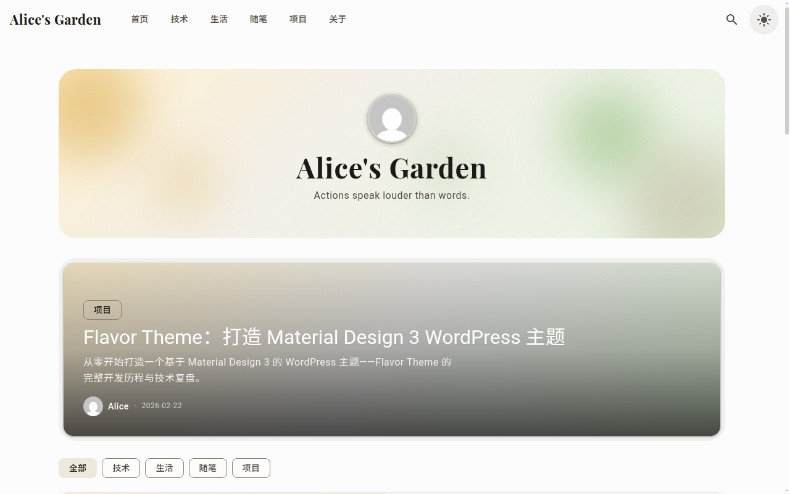
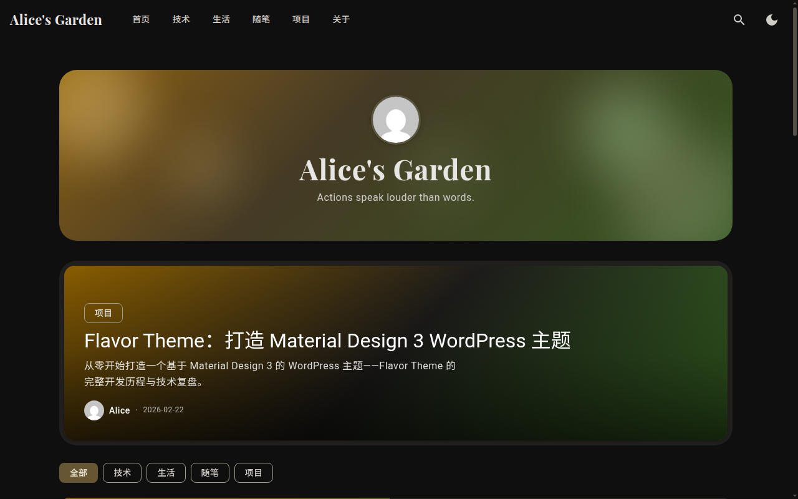

<div align="center">

# 🍦 Flavor Theme

### Material Design 3 WordPress Theme

A modern WordPress theme built from scratch with Google's Material Design 3 specification.\
Dynamic color engine, zero-flicker dark mode, and a premium blogging experience.

[](https://github.com/one-ea/Nova-Blog/releases)
[](LICENSE)
[](https://wordpress.org)
[](https://www.php.net)
[](https://m3.material.io)

<br>

<picture>
  <source media="(prefers-color-scheme: dark)" srcset=".github/assets/screenshot-dark.png">
  <source media="(prefers-color-scheme: light)" srcset=".github/assets/screenshot-light.png">
  
</picture>

<br>

**[Live Demo](https://www.roxilodz.eu.org)** · **[Installation](#-quick-start)** · **[Features](#-features)** · **[Customization](#-customization)**

</div>

<br>

## Why Flavor?

Most WordPress themes bolt on a CSS framework and call it a day. **Flavor** is different — it implements the full Material Design 3 specification natively in PHP and vanilla JavaScript, with no framework dependencies. Every color token, every elevation layer, every state interaction follows Google's design system precisely.

The result is a theme that feels like a native app, loads fast, and looks beautiful on every screen.

<br>

## ✨ Features

<table>
<tr>
<td width="33%" valign="top">

### 🎨 Dynamic Color Engine
A PHP + JS synchronized color engine generates a complete M3 palette from a single seed color. 28 tonal palettes, 5 accent schemes, all in real-time.

</td>
<td width="33%" valign="top">

### 🌓 Zero-Flicker Dark Mode
Server-side inline CSS + View Transition API delivers smooth, instant theme switching with absolutely zero flash of unstyled content.

</td>
<td width="33%" valign="top">

### 📱 Fully Responsive
From mobile to ultrawide, every component adapts fluidly. Adaptive navigation collapses gracefully, cards reflow, and typography scales.

</td>
</tr>
<tr>
<td width="33%" valign="top">

### 🔍 Built-in SEO
Open Graph, Twitter Cards, JSON-LD structured data, and a dedicated meta box for per-post SEO — all without plugins.

</td>
<td width="33%" valign="top">

### ⚡ PWA Ready
Service Worker with intelligent caching strategies — cache-first for static assets, network-first for pages. Works offline.

</td>
<td width="33%" valign="top">

### 🎭 M3 Surface Tint
Proper elevation system with surface tint overlays, state layers for hover/press/focus, and ripple effects on interactive elements.

</td>
</tr>
<tr>
<td width="33%" valign="top">

### 📑 Smart TOC
Auto-generated table of contents with active section tracking, smooth scroll, and hierarchy-aware visual differentiation.

</td>
<td width="33%" valign="top">

### ⚙️ 30+ Customizer Options
Colors, typography, layouts, header styles, footer widgets, social links — all configurable through the WordPress Customizer.

</td>
<td width="33%" valign="top">

### 🌐 i18n Ready
Full translation support with Chinese (zh_CN) included. RTL-compatible layout structure.

</td>
</tr>
</table>

<br>

## 📸 Screenshots

<div align="center">
<table>
<tr>
<td align="center"><strong>Light Mode</strong></td>
<td align="center"><strong>Dark Mode</strong></td>
</tr>
<tr>
<td></td>
<td></td>
</tr>
</table>
</div>

<br>

## 🚀 Quick Start

### Method 1: Download ZIP

1. Download the latest release from [Releases](https://github.com/one-ea/Nova-Blog/releases)
2. In WordPress admin, go to **Appearance → Themes → Add New → Upload Theme**
3. Upload the `flavor-theme.zip` file and activate

### Method 2: Clone

```bash
cd wp-content/themes/
git clone https://github.com/one-ea/Nova-Blog.git
# The theme is in the flavor-theme/ directory
```

### Requirements

| Requirement | Version |
|------------|--------|
| WordPress  | 6.0+   |
| PHP        | 8.0+   |

<br>

## 🎨 Customization

Navigate to **Appearance → Customize** to access all theme settings:

<details>
<summary><strong>Color & Appearance</strong></summary>

- **Seed Color** — Pick any color, the M3 engine generates a complete palette
- **Color Scheme** — Choose from 5 accent schemes (Tonal, Vibrant, Expressive, Neutral, Fidelity)
- **Dark Mode** — Auto (system), Light, or Dark
- **Surface Tint** — Control elevation appearance intensity

</details>

<details>
<summary><strong>Layout & Typography</strong></summary>

- **Content Width** — Adjust max-width for readability
- **Sidebar** — Enable/disable, choose left or right
- **Font Family** — System fonts or custom Google Fonts
- **Font Scale** — Global typography scaling

</details>

<details>
<summary><strong>Header & Navigation</strong></summary>

- **Site Logo & Title** — Upload logo, set display options
- **Navigation Style** — Horizontal, hamburger, or adaptive
- **Sticky Header** — Pin navigation on scroll
- **Search Toggle** — Show/hide search in header

</details>

<details>
<summary><strong>Blog & Content</strong></summary>

- **Featured Post** — Highlight a hero article on homepage
- **Card Layout** — Grid or list view for archives
- **Excerpt Length** — Control preview text length
- **Reading Time** — Show estimated read duration
- **View Count** — Display post view statistics

</details>

<details>
<summary><strong>SEO Settings</strong></summary>

- **Open Graph** — Auto-generated social sharing metadata
- **Twitter Cards** — Summary with large image support
- **JSON-LD** — Structured data for search engines
- **Per-Post Meta** — Custom title, description, and keywords via meta box

</details>

<br>

## 🏗️ Architecture

```
flavor-theme/
├── style.css                   # Theme metadata
├── functions.php               # Core initialization & version control
├── inc/
│   ├── color-engine.php        # M3 dynamic color generation (PHP)
│   ├── customizer.php          # 30+ Customizer settings
│   ├── enqueue.php             # Asset loading & inline critical CSS
│   ├── seo.php                 # Open Graph, JSON-LD, meta tags
│   └── seo-metabox.php         # Per-post SEO meta box
├── assets/
│   ├── css/
│   │   ├── tokens.css          # M3 design tokens (18KB)
│   │   ├── base.css            # Reset & foundations
│   │   ├── components.css      # UI components (37KB)
│   │   └── theme.css           # Layouts & page styles (66KB)
│   ├── js/
│   │   ├── color-engine.js     # Client-side color generation
│   │   ├── theme-toggle.js     # Dark mode switching
│   │   ├── toc.js              # Table of contents
│   │   ├── search.js           # Live search
│   │   └── ...                 # 11 specialized modules
│   └── dist/                   # Production builds
├── template-parts/             # Modular template components
├── sw.js                       # Service Worker (PWA)
└── build.mjs                   # esbuild configuration
```

<br>

## 🎯 Design Tokens

Flavor implements the complete M3 token system as CSS custom properties:

```css
/* Auto-generated from seed color */
--md-sys-color-primary: #6750A4;
--md-sys-color-on-primary: #FFFFFF;
--md-sys-color-primary-container: #EADDFF;
--md-sys-color-surface: #FFFBFE;
--md-sys-color-surface-container: #F3EDF7;
/* ... 40+ semantic tokens */

/* Elevation with surface tint */
--md-sys-elevation-1: /* surface + 5% primary */;
--md-sys-elevation-2: /* surface + 8% primary */;
--md-sys-elevation-3: /* surface + 11% primary */;

/* State layers */
--md-sys-state-hover-opacity: 0.08;
--md-sys-state-pressed-opacity: 0.12;
--md-sys-state-focus-opacity: 0.12;
```

<br>

## 🛠️ Tech Stack

| Category | Technology |
|----------|----------|
| **Design System** | Material Design 3 (full spec) |
| **Backend** | PHP 8.0+, WordPress 6.0+ |
| **Frontend** | Vanilla JS (zero framework dependencies) |
| **Styling** | CSS Custom Properties, M3 Tokens |
| **Build** | esbuild (fast, modern bundler) |
| **PWA** | Service Worker, Cache API |
| **SEO** | Open Graph, Twitter Card, JSON-LD |
| **Color Science** | HCT color space, tonal palettes |

<br>

## 📄 License

This project is licensed under the **GNU General Public License v2.0** — see the [LICENSE](LICENSE) file for details.

<br>

<div align="center">

Built with ☕ and Material Design 3

**[⬆ Back to Top](#-flavor-theme)**

</div>
